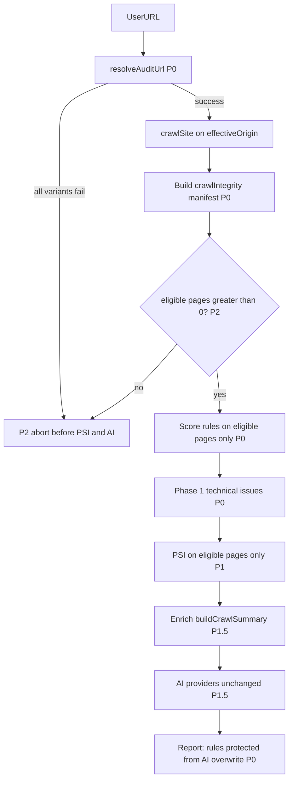
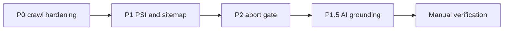

# Crawl Reliability Hardening (P0–P2 + P1.5 AI Grounding)

## Problem

Auditing `https://www.lightpink-fox-288234.hostingersite.com/` fails Node TLS validation while the apex URL works. Today [`safeFetchWithTrace`](lib/audit/security.ts) throws, the crawler [`catch`es and returns empty HTML](lib/audit/crawler.ts) (lines 167–169), and PSI still runs via Google's servers — producing contradictory reports (meta 0 vs PSI 92).

Additionally, **rules-based findings are not protected** once AI runs: [`orchestrator.ts`](lib/audit/orchestrator.ts) (lines 158–166) lets AI `technicalNarratives` overwrite `finding`/`fix` on all technical cards, including verified ones. Failed fetches are scored as real zeros (`meta tags: 0 VERIFIED`) rather than unverified fetch failures.

The AI prompt in [`buildAIPrompt`](lib/audit/ai/schema.ts) receives a thin [`buildCrawlSummary`](lib/audit/ai/index.ts) with no fetch errors, crawl scope, or rule scores — causing models to infer full-site narratives from empty snippets (e.g. GEO 8 vs 92 on the same shell).

**Scope constraint:** AI provider/model calls stay unchanged. P0–P2 fix data gathering and rules-first reporting. P1.5 adds summary enrichment + grounding prompt constraints after crawl data is trustworthy.

## Target flow



## Recommended sequencing

Implement in this order — each phase depends on the prior:



1. **P0** — URL resolution, fetch errors, eligible-page scoring, crawlIntegrity manifest, protect rules from AI overwrite
2. **P1** — Same-origin sitemap, PSI gating, rules-first recommendations
3. **P2** — Hard abort before Lighthouse/AI on failed crawls; partial-crawl soft gate
4. **P1.5** — Enrich `buildCrawlSummary` + grounding prompt constraints
5. **Verify** — Re-run SetupDay with/without `www`; confirm AI findings align with rule cards

**Rationale:** ~80% of reliability is upstream crawl/code. Prompt changes reduce hallucination and score drift but cannot fix TLS failures or empty HTML. P1.5 runs last so models receive accurate `crawlIntegrity` and rule scores instead of inferring from thin snippets.

---

## Plan review — critical gaps addressed

| Gap | Risk | Addition to plan |
|-----|------|------------------|
| AI overwrites verified rule findings | Report contradicts extracted HTML | Protect rules narratives (P0) |
| Failed fetches scored as VERIFIED zeros | False "missing meta" vs "couldn't fetch" | Score eligible pages only + chip fix (P0) |
| robots/llms/sitemap use broken `www` origin | Discovery fails even after apex probe | Use effective origin everywhere (P0) |
| No crawl transparency | User can't trust page counts | `crawlIntegrity` manifest in report (P0) |
| PSI SEO blends when crawl failed | SEO cell contradicts technical cards | Skip PSI blend when lighthouse skipped (P1) |
| Phase 1 issues on empty pages | Noise / false positives | Skip `fetchError` pages in analyze (P0) |
| Abort runs after Lighthouse starts | Wasted PSI quota on bad crawls | Gate before Lighthouse **and** AI (P2) |
| Same-origin sitemap → 1 page only | Looks like broken crawl | Scope disclaimer + rules recommendation (P1) |
| Thin AI summary → hallucination | GEO/AEO score drift, false "no sitemap" | Summary enrichment + grounding prompt (P1.5) |

---

## P0 — URL resolution, fetch errors, and rules-first integrity

### 1. New module: [`lib/audit/url-resolve.ts`](lib/audit/url-resolve.ts)

**`resolveAuditUrl(input, signal)`** returns:

```typescript
interface UrlResolution {
  requestedUrl: string;
  effectiveUrl: string;
  effectiveOrigin: string;
  note?: string;
  candidatesTried: { url: string; error?: FetchErrorCode }[];
}
```

**Candidate order:**
1. Normalized input URL
2. If hostname starts with `www.` → strip `www.` (apex)
3. Only if apex failed and input had no `www` → prepend `www.`

**Probe success criteria:**
- HTTP status 200–399
- `Content-Type` includes `text/html` (or empty content-type with HTML body)
- Body length ≥ 500 bytes
- Record redirect chain during probe

Do **not** disable TLS verification.

### 2. Extend [`lib/audit/security.ts`](lib/audit/security.ts)

- `FetchErrorCode`: `TLS_HOST_MISMATCH | DNS_FAILED | TIMEOUT | HTTP_ERROR | TOO_MANY_REDIRECTS | NETWORK_ERROR`
- `class FetchError extends Error` with `{ code, url, detail? }`
- `safeFetchWithTrace` throws `FetchError` on TLS/DNS failures
- Export **`probeUrl(url, signal)`** with SSRF checks via `assertSafeUrl`

### 3. Extend [`PageExtract`](lib/audit/types.ts) + helpers in [`lib/audit/crawler.ts`](lib/audit/crawler.ts)

```typescript
fetchError?: FetchErrorCode;
fetchErrorDetail?: string;

export function isPageSuccessfullyFetched(p: PageExtract): boolean;
export function getEligiblePages(pages: PageExtract[]): PageExtract[];
```

### 4. Update [`lib/audit/crawler.ts`](lib/audit/crawler.ts)

- Seed crawl from `resolution.effectiveUrl` / `effectiveOrigin`
- Propagate `FetchError` into page extract (not silent empty page)
- Set `blocked: true` only when fetch succeeded but content is thin
- Pass `effectiveOrigin` into `fetchRobotsTxt`, `fetchLlmsTxt`, `discoverSitemapUrls`

### 5. Score only confirmed data — [`lib/audit/rules.ts`](lib/audit/rules.ts)

- Page-based scorers use `getEligiblePages(crawl.pages)`
- Zero eligible pages → `chip: "unverified"`, scores not computed
- Partial fetch → finding notes *"Based on N of M successfully fetched pages"*
- `scoreRobots` / `scoreSitemap`: distinguish TLS fetch failure vs truly missing (404)

### 6. Phase 1 analysis filter — [`lib/audit/technical/analyze.ts`](lib/audit/technical/analyze.ts)

Skip pages with `fetchError` or `!isPageSuccessfullyFetched()`.

### 7. Protect rules-first narratives — [`lib/audit/orchestrator.ts`](lib/audit/orchestrator.ts)

**Do not change AI provider calls.** AI may nudge score on `inferred`/`unverified` only; never replace `finding`/`fix` on `verified`/`estimated` cards.

### 8. Crawl integrity manifest — [`lib/audit/types.ts`](lib/audit/types.ts)

```typescript
crawlIntegrity: {
  requestedUrl: string;
  effectiveCrawlUrl: string;
  urlResolutionNote?: string;
  pagesDiscovered: number;
  pagesEligible: number;
  pagesFailed: number;
  fetchErrors: Partial<Record<FetchErrorCode, number>>;
  robotsFetched: boolean;
  sitemapPresent: boolean;
  sitemapSameOriginCount: number;
  sitemapSkippedOffOriginCount: number;
  internalLinksDiscovered: number;
  scopeLimitations: string[];
}
```

**UI:** [`components/CrawlIntegrityPanel.tsx`](components/CrawlIntegrityPanel.tsx) above Technical Cards.

Bump `schemaVersion` to **`1.1`**.

### 9–10. Orchestrator wiring + [`components/HeroReport.tsx`](components/HeroReport.tsx)

Pre-flight resolve → crawl → manifest → P2 gate. Show effective URL when different from input.

---

## P1 — PSI gating, sitemap policy, scope-aware recommendations

### 11. Same-origin sitemap filter — [`lib/audit/sitemap.ts`](lib/audit/sitemap.ts)

Return `{ urls, present, skippedOffOrigin, offOriginDomains }`. Warn-only policy: do not crawl off-origin URLs.

### 12. Rules-first recommendations — [`lib/audit/recommendations.ts`](lib/audit/recommendations.ts)

Insert crawl-scope rules items before AI fixes when off-origin sitemap, partial fetch, or low coverage.

### 13–14. PSI gating — [`lib/audit/lighthouse.ts`](lib/audit/lighthouse.ts) + [`lib/audit/scorer.ts`](lib/audit/scorer.ts)

Eligible pages only; `status: "skipped"` when none; skip PSI SEO blend when skipped.

### 15. SPA false positive fix — orchestrator

SPA unverified only when fetch succeeded but content thin. Separate unverified for fetch errors.

---

## P2 — Crawl integrity gate (abort before PSI and AI)

### 16. Hard abort conditions

Abort **before** `runLighthouseAudit` and `runAllProviders` when:
1. `resolveAuditUrl` exhausts all candidates
2. Zero pages pass `isPageSuccessfullyFetched`
3. Seed page not successfully fetched

### 17. Partial crawl handling

When `pagesEligible > 0` but `pagesFailed > 0`: continue with scope notes and partial verdict suffix.

---

## P1.5 — AI grounding (summary enrichment + prompt constraints)

**Scope:** No provider, model, or parallel-call changes. Only **input summary** and **prompt instructions** change.

**Prerequisite:** P0–P2 complete.

### 18. Enrich `buildCrawlSummary` — [`lib/audit/ai/index.ts`](lib/audit/ai/index.ts)

**Better input beats a longer creative prompt.**

Add top-level fields:

```typescript
{
  crawlIntegrity: { ... },
  ruleScores: Record<TechnicalElementId, { score, chip }>,
  technicalIssueCounts: { redirect, canonical, hreflang, structured-data, total },
  partialCrawl: boolean,
}
```

Per-page (include fetch metadata; **omit `textSnippet`** when fetch failed):

```typescript
{
  url, finalUrl, fetchError, fetchErrorDetail, statusCode, htmlLength,
  title, h1, wordCount, jsonLdTypes,
  hasCanonical, canonicalUrl, hreflangCount,
  thin, blocked, landmarks,
  textSnippet,  // only if isPageSuccessfullyFetched(p)
}
```

Change signature: `buildCrawlSummary(crawl, context)` where context carries `crawlIntegrity`, rule scores, and technical issue counts from orchestrator.

### 19. Grounding instructions — [`lib/audit/ai/schema.ts`](lib/audit/ai/schema.ts) `buildAIPrompt`

Keep `temperature: 0` in providers unchanged. Add constraints:

**Grounding rules (high ROI):**
- Base findings **only** on fields in `crawlSummary`. Do not claim missing robots, sitemap, title, or H1 if summary shows they exist.
- If `crawlIntegrity.pagesEligible === 0`, return low-confidence scores (≤20) and state crawl did not retrieve content.
- If `wordCount === 0` but `htmlLength > 0`, say *"static HTML shell — content may be JS-rendered"*; do not assert site has no content as fact.
- Do not contradict `robotsTxt.fetched`, `sitemap.present`, extracted `title`, `h1`, `jsonLdTypes`.
- When `partialCrawl` or `scopeLimitations` is non-empty, lead findings with crawl scope caveats.

**Score calibration (medium ROI):**
- When `pagesEligible < pagesDiscovered`, mention partial crawl; avoid extreme scores unless summary facts warrant them.
- Align factual SEO signals with `ruleScores`; use GEO/AEO/Structured for interpretive visibility.

**`technicalNarratives` (align with P0):**
- Optional; only when `ruleScores[id].chip` is `inferred` or `unverified`.
- `nudge` (-5 to +5) only — do not restate rule findings.

**Ranked fixes de-duplication:**
- Do not repeat `scopeLimitations` or obvious rule gaps (robots, sitemap, JSON-LD).
- Focus `rankedFixes` on GEO/AEO strategy beyond extracted facts.

### 20. Orchestrator wiring

After rules + technical issues, before `runAllProviders`:

```typescript
const summary = buildCrawlSummary(crawl, { crawlIntegrity, technical, technicalIssues });
```

### 21. What prompts must NOT do

- Detect redirects, canonicals, hreflang, schema (code handles this)
- Verify robots/sitemap against "live site"
- Work around crawl/TLS failures
- Replace verified rule findings

### 22. P1.5 verification

- SetupDay staging: AI references `scopeLimitations` for off-origin sitemap
- AI does not report "no sitemap" when `sitemap.present: true`
- Scores stable on re-run with same summary (`temperature: 0` + grounding)
- Verified technical card findings unchanged after AI runs

---

## Files touched (summary)

| File | Changes |
|------|---------|
| [`lib/audit/url-resolve.ts`](lib/audit/url-resolve.ts) | **New** |
| [`lib/audit/security.ts`](lib/audit/security.ts) | FetchError, probeUrl |
| [`lib/audit/types.ts`](lib/audit/types.ts) | crawlIntegrity, schemaVersion 1.1 |
| [`lib/audit/crawler.ts`](lib/audit/crawler.ts) | fetchError, eligible helpers |
| [`lib/audit/rules.ts`](lib/audit/rules.ts) | eligible-page scoring |
| [`lib/audit/technical/analyze.ts`](lib/audit/technical/analyze.ts) | skip failed pages |
| [`lib/audit/sitemap.ts`](lib/audit/sitemap.ts) | same-origin filter |
| [`lib/audit/lighthouse.ts`](lib/audit/lighthouse.ts) | PSI gating |
| [`lib/audit/scorer.ts`](lib/audit/scorer.ts) | PSI blend skip |
| [`lib/audit/orchestrator.ts`](lib/audit/orchestrator.ts) | resolve → manifest → gate → protect rules → enriched summary |
| [`lib/audit/recommendations.ts`](lib/audit/recommendations.ts) | crawl-scope rules items |
| [`lib/audit/ai/index.ts`](lib/audit/ai/index.ts) | **P1.5** enriched buildCrawlSummary |
| [`lib/audit/ai/schema.ts`](lib/audit/ai/schema.ts) | **P1.5** grounding prompt |
| [`components/CrawlIntegrityPanel.tsx`](components/CrawlIntegrityPanel.tsx) | **New** |
| [`components/HeroReport.tsx`](components/HeroReport.tsx) | effective URL + partial crawl |
| [`components/LighthousePanel.tsx`](components/LighthousePanel.tsx) | skipped state |
| [`lib/fixtures/sample-report.ts`](lib/fixtures/sample-report.ts) | crawlIntegrity demo |

---

## Verification (manual test plan)

1. **`www` Hostinger URL** — resolves to apex, crawlIntegrity note, eligible pages, Phase 1 issues
2. **Both variants fail TLS** — abort before PSI/AI
3. **SetupDay staging** — off-origin sitemap warning, rules recommendation
4. **PSI** — eligible pages only; no crawl/PSI contradiction
5. **Verified card protection** — rule findings survive AI run
6. **Partial crawl** — eligible-subset scoring + scope note
7. **P1.5 grounding** — AI aligns with summary; no sitemap/title contradictions

---

## Explicitly out of scope

- Playwright / JS rendering
- Changes to which AI providers or models are called
- Auto-follow off-site sitemap URLs
- TLS bypass
- New AI metrics or scoring formulas for GEO/AEO/Structured
- Large rubric rewrites for GEO/AEO/Structured pillars

---

## ROI summary

1. **Protect rules from AI narrative overwrite** (P0)
2. **crawlIntegrity manifest** (P0)
3. **Eligible-page-only scoring** (P0)
4. **effectiveOrigin everywhere** (P0)
5. **Abort before PSI + AI** (P2)
6. **P1.5 AI grounding** — enriched summary + prompt constraints (~20% of remaining integrity gap)
